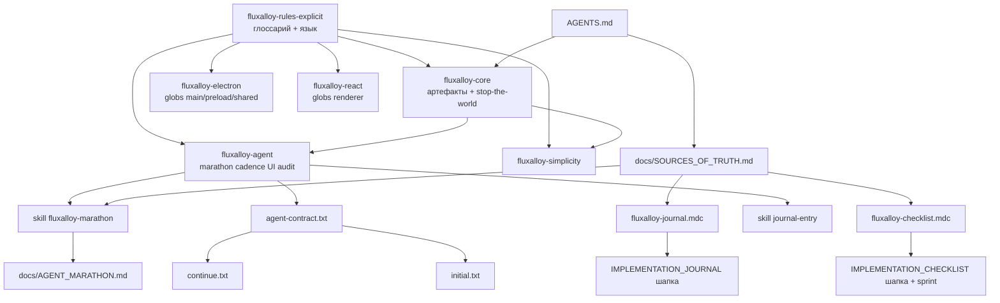

# Временный план: упрощение AI governance (FluxAlloy)

**Статус:** временный execution plan. **Не** источник истины.  
**Приоритет №1:** пока этот файл существует, любая работа вне выполнения этого плана **запрещена** без явной просьбы владельца отменить или приостановить план.  
**После выполнения:** не удалять автоматически; итог оставить в существующих rules/docs/skills + одной строкой `IMPLEMENTATION_JOURNAL.md`, а этот файл удалить **только** после явной просьбы владельца «удали план».  
**Запрещено:** удалять этот файл до полного выполнения фаз 1–5 и без явной просьбы владельца «удали план»; оставлять этот файл как постоянный governance-слой; копировать его целиком в `.cursor/rules`.

**Цель:** уменьшить cognitive load агента, sync points и ритуалы без потери Electron safety, IPC discipline, simplicity / anti-overengineering.

---

## 0. Что не так произошло

J-1344 преждевременно удалил этот файл, хотя план **не был выполнен методично**: не было полной read-only inventory, A/B/C-классификации и явного diff-plan перед apply. Этот файл восстановлен как рабочий маршрут; дальнейшие шаги должны идти по нему.

---

## 1. Объединение 4 промптов

| # | Суть | Что взять |
|---|------|-----------|
| 1 | Full architectural/product/governance audit | Read-only inventory, repo-wide cross-reference, не поверхностный анализ |
| 2 | Product > process, не расширять governance | Главный принцип и gate перед новым rule/process |
| 3 | Targeted governance simplification | Практические pain points: sync, marathon, cadence/journal, duplicated concepts |
| 4 | Governance audit + A/B/C | Таблица по каждому requirement: value, cost, duplicates, merge/remove |

**Итоговая логика:** inventory → requirement extraction → A/B/C classification → proposed diff plan → approval → apply → validation → запросить у владельца разрешение удалить план.

---

## 2. Принципы pass

1. Keep product development moving.
2. Keep architecture understandable.
3. Keep governance lightweight.
4. Avoid process overhead.
5. Avoid unnecessary abstractions.

Перед добавлением нового rule / ritual / sync requirement / manifest / process doc / audit system объяснить:

- почему текущий workflow недостаточен;
- почему проще альтернативы не решают проблему;
- какой long-term maintenance cost добавляется.

**Предпочитать:** fewer rules, fewer sync points, fewer mandatory updates, simpler workflows, direct implementation.

---

## 3. HARD protections: не удалять

- Electron: main-only spawn/FS, argv без shell, narrow preload bridge, no Node в renderer.
- IPC discipline: новый/изменённый канал = `ipc-channels` + main handler + preload expose + renderer call + tests по локальному паттерну.
- Simplicity: renderer → IPC → `src/main/*-service.ts` → `spawn` / `execFile`; без DI/container/plugin-bus/orchestrator слоёв без причины.
- UI surfaces: один renderer на фичу, без HTML pop-out, строки через `ui-text` / `locales`.
- `check:quiet` как единый gate; не плодить параллельные «полные check».
- ТЗ (`FLUXALLOY_TZ.md`) не редактировать без явной просьбы владельца.

---

## 4. Scope: все governance/process surfaces

### Tier A — обязательно анализировать и потенциально править

| Путь | Почему в scope |
|------|----------------|
| `.cursor/rules/*.mdc` | Исполняемые правила агента |
| `.cursor/skills/fluxalloy-*/SKILL.md` | Длинные процедуры, которые лучше держать вне alwaysApply |
| `AGENTS.md` | Первый индекс для агента |
| `README.md` | Иногда дублирует check/release/process |
| `IMPLEMENTATION_JOURNAL.md` | Только шапка + новые J, не исторические строки |
| `IMPLEMENTATION_CHECKLIST.md` | Только шапка + `## Ближайший TODO спринта` |
| `docs/SOURCES_OF_TRUTH.md` | Иерархия и sync burden |
| `docs/AGENT_MARATHON.md` | Marathon snapshot / re-anchor |
| `docs/AGENT_OPERATIONAL_NOTES.md` | Operational notes, не исполняемое |
| `docs/AGENT_SESSION_HANDOFF.md` | Optional handoff |
| `docs/ARCHITECTURE.md` | Canon architecture links; править только при дублировании process |
| `docs/RELEASE.md` | Release workflow; не смешивать с AI cadence |
| `scripts/cursor-automation/prompts/*.txt` | SDK behavior |

### Tier B — анализировать, править только при прямой связи

| Путь | Почему в scope |
|------|----------------|
| `package.json` | `check:*`, `audit:*`, `agent:session` scripts |
| `scripts/run-quiet-check.mjs` | Реальный список gate, не дублировать вручную |
| `scripts/check-rules-explicit.mjs` | Ограничения языка rules |
| `scripts/check-docs-governance.mjs` | Governance/doc links guard |
| `scripts/check-journal-numbering.mjs` | Journal/cadence guard |
| `scripts/check-checklist-sprint.mjs` | Sprint block guard |
| `scripts/agent-session.mjs` | `continue_count` / bump |
| `scripts/audit-*.mjs`, `scripts/check-*.mjs` | Tooling rules encoded as scripts |

### Tier C — cross-reference only

`Help/**`, `bin/README.md`, `docs/audit-manifest.json`, `docs/BUNDLED_ENGINES_LICENSES.md`, `FLUXALLOY_TZ.md` — не переписывать в этом pass, кроме сломанных ссылок/явного дублирования governance.

---

## 5. Как не пропустить файлы

1. Прочитать Tier A.
2. По Tier B минимум собрать ссылки/guard expectations.
3. По repo выполнить поиск ключей: `fluxalloy-`, `SOURCES_OF_TRUTH`, `AGENT_MARATHON`, `agent-contract`, `check:quiet`, `Cadence Git`, `marathon`, `continue_count`, `re-anchor`, `IMPLEMENTATION_JOURNAL`, `alwaysApply`.
4. Построить список **requirements**, а не просто список файлов.
5. Для каждого requirement отметить источник(и), дубли, category A/B/C, proposed action.

---

## 6. Целевое состояние (не «новая модель»)

Сжать **существующую** governance-структуру; не вводить новый framework.

| Слой | Сейчас | Цель после pass |
|------|--------|-----------------|
| AlwaysApply | 4 файла + длинный глоссарий | Короткий `core` + `explicit` (сжатый глоссарий) + `agent` (только HARD + ссылки) + `simplicity` |
| Процедуры | Rules + docs + contract | **Skills** (marathon, journal, release, checklist-audit) |
| Sync | Большая таблица «обновить вместе» | Минимум тем + **один канонический файл на тему** |
| Marathon | Doc + skill + agent + glossary | Skill + короткий re-anchor block в `AGENT_MARATHON.md` |
| Индекс | AGENTS + README + contract | AGENTS короткий; README → ссылка на `AGENTS.md` / `check:quiet` |

**Ощущение для агента:** сначала HARD (безопасность и простота кода), потом задача; SOFT — по режиму (marathon / release / audit checklist).

**Частично уже сделано (J-1344, не считать pass завершённым):** сжата группировка sync в `SOURCES_OF_TRUTH.md`; упрощён `AGENT_MARATHON.md`; cadence override в `fluxalloy-agent.mdc` / `agent-contract.txt`; re-anchor в skill marathon без обязательного правки SOURCES/sprint каждый раз. Осталось: inventory, A/B/C, согласованный diff-plan, полный apply, сжатие alwaysApply/glossary.

---

## 7. Чеклист «ничего не пропустить»

- [x] Все 8 `.cursor/rules/*.mdc` прочитаны; финальная классификация A/B/C — §12.1 + §13.1.
- [x] Все 4 skills `fluxalloy-*` прочитаны; что держать только в skill — §12 «Процедуры в skills».
- [x] `AGENTS.md`, `README.md` — cadence override в индексе (J-1350); Help §21 — без изменений (R13).
- [x] Шапки `IMPLEMENTATION_JOURNAL.md`, `IMPLEMENTATION_CHECKLIST.md` согласованы с `fluxalloy-journal.mdc` / `fluxalloy-checklist.mdc` (строка **Если** меняете **Cadence Git** → `SOURCES_OF_TRUTH`; J-1350).
- [x] `SOURCES_OF_TRUTH.md` — Cadence Git sync (J-1349); дальнейшее сжатие таблицы — только с guards.
- [x] `AGENT_MARATHON.md`, `agent-contract.txt`, `continue.txt`, `initial.txt` — cadence override (J-1349).
- [x] `ARCHITECTURE.md` / `RELEASE.md` — не дублируют AI cadence (inventory §12; RELEASE — guards/AGENTS).
- [x] `package.json` + `run-quiet-check.mjs` — без изменений набора gate (итерация J-1350).
- [~] `rg` по ключевым словам — нет «осиротевших» ссылок (выборочно при apply; полный pass — опционально перед фазой 6).
- [x] `check:rules-explicit`, `check:docs-governance`, `check:journal`, `check:checklist` зелёные после apply (J-1350).
- [x] `check:quiet` зелёный после apply (J-1350).
- [ ] Владелец явно попросил «удали план» после фаз 1–5
- [ ] Этот файл **удалён** (только в фазе 6, после явной просьбы владельца)

---

## 8. Фазы выполнения

### Фаза 1 — Read-only inventory

Для каждого requirement ответить:

1. Какую проблему решает?
2. Проблема всё ещё актуальна?
3. Класс: critical / useful / optional / obsolete.
4. Cognitive overhead: low / medium / high.
5. Дублирует ли другой requirement?
6. Можно ли merge в более широкое правило?
7. Замедляет ли small/simple tasks?
8. Увеличивает ли sync burden?

**Output:** таблица requirements + карта ссылок. **Не править файлы** (кроме этого плана — фиксация результата фазы 1 в §12).

**Результат фазы 1:** §12.

### Фаза 2 — A/B/C classification

| Категория | Значение |
|-----------|----------|
| A — HARD | Electron safety, IPC, renderer/main, spawn, simplicity |
| B — SOFT | Journal, checklist, marathon, release, handoff, re-anchor |
| C — MERGE / REMOVE | Дубли, устаревшее, excessive sync, AI-confusing process |

### Фаза 3 — Diff plan before apply

До правок показать:

- files to modify;
- files not to touch;
- what stays canonical;
- what moves to skills;
- what becomes a link instead of duplicated prose;
- what is removed;
- risk of each removal.

**Stop:** ждать подтверждение владельца.

### Фаза 4 — Apply simplification

Разрешено:

- сокращать prose-дубли;
- переносить длинные процедуры в skills (если skill уже есть);
- уменьшать sync table;
- делать soft workflow мягче;
- сохранять HARD rules строгими.

Запрещено:

- новые `.mdc`, skills, manifests, process docs;
- product code refactor;
- менять набор `check:quiet` без отдельного обоснования;
- удалять HARD safeguards.

### Фаза 5 — Validation

Минимум:

```powershell
npm run check:rules-explicit
npm run check:docs-governance
npm run check:journal
npm run check:checklist
```

При широких правках:

```powershell
npm run check:quiet
```

### Фаза 6 — Cleanup

1. Одна J с реальным итогом.
2. Cadence Git по действующим правилам и пользовательским ограничениям.
3. Остановиться и запросить у владельца подтверждение удаления плана.
4. Удалить этот файл **только** если владелец явно написал «удали план».
5. Снять временный приоритет №1 из `fluxalloy-core.mdc`, `AGENTS.md`, `agent-contract.txt` только вместе с удалением плана.
6. Не добавлять этот файл в `SOURCES_OF_TRUTH`.

---

## 9. Риски pass (честно)

- Упростить текст, но **оставить те же обязательства** → нулевой выигрыш.
- Удалить cadence/marathon prose → сломать SDK loop continuity.
- Разъехаться `rules-explicit` глоссарий ↔ `check-journal` / `check-checklist`.
- Преждевременно удалить этот план (как в J-1344) → потеря маршрута и ложное «готово».
- Создать этот план как постоянный артефакт → **запрещено**; после фаз 1–5 удалить только по явной просьбе владельца.

---

## 10. Текущий статус

- [x] Временный план восстановлен после преждевременного удаления.
- [x] Временный приоритет №1 восстановлен в `fluxalloy-core.mdc`, `AGENTS.md`, `agent-contract.txt`.
- [x] Фаза 1 read-only inventory выполнена (§12).
- [x] Фаза 2 classification выполнена (§12.1, §13.1).
- [x] Фаза 3 diff plan согласован владельцем («продолжай» → фаза 4).
- [x] Фаза 4 apply выполнена (J-1349 пакеты 1–2; J-1350 пакет 3: AGENTS/README cadence override, journal/checklist rules ↔ SOURCES при Cadence).
- [x] Фаза 5 validation выполнена (`check:quiet` J-1350).
- [ ] Владелец явно попросил удалить план после фаз 1–5.
- [ ] Фаза 6 cleanup выполнена.

---

## 11. Success criteria

- Меньше mandatory sync points.
- Меньше duplicated cadence/marathon/journal prose.
- AlwaysApply rules короче и жёстче по HARD protections.
- Длинные процедуры открываются через skills, а не всегда грузятся в контекст.
- Нет новых постоянных governance documents.
- Этот файл удалён только после выполнения фаз 1–5 и явной просьбы владельца «удали план».

---

## 12. Фаза 1 — результат (read-only inventory)

**Дата:** 2026-05-19. **Scope Tier A прочитан:** все 8 `.cursor/rules/*.mdc` (`fluxalloy-rules-explicit`, `fluxalloy-core`, `fluxalloy-agent`, `fluxalloy-simplicity`, `fluxalloy-electron`, `fluxalloy-react`, `fluxalloy-checklist`, `fluxalloy-journal`); 4 skills `fluxalloy-marathon`, `fluxalloy-journal-entry`, `fluxalloy-checklist-audit`, `fluxalloy-release`; `AGENTS.md`, `README.md` (шапка + быстрый старт), шапки `IMPLEMENTATION_JOURNAL.md` / `IMPLEMENTATION_CHECKLIST.md`, `docs/SOURCES_OF_TRUTH.md`, `docs/AGENT_MARATHON.md`, `docs/AGENT_OPERATIONAL_NOTES.md`, `docs/AGENT_SESSION_HANDOFF.md`, `scripts/cursor-automation/prompts/agent-contract.txt`, `continue.txt`, `initial.txt`. **Tier A частично:** `docs/ARCHITECTURE.md` / `docs/RELEASE.md` — только `rg` на AI-cadence (в `ARCHITECTURE.md` совпадений нет; в `RELEASE.md` — ссылки на guards/AGENTS, не дубль marathon).

### 12.1. Таблица requirements (финал классов A/B/C — фаза 2)

**Класс:** A = HARD (§8); B = SOFT; C = merge/remove **целого требования** — таких **нет** (есть только **C-targets**: избыточный prose, §13.5).

| ID | Требование | Источники | Проблема / ценность | Актуально? | Класс | Overhead | Дубли | Sync burden | Заметка для фазы 3+ |
|----|------------|-----------|---------------------|------------|-------|----------|-------|-------------|---------------------|
| R1 | Однозначный язык rules + `check:rules-explicit` | `fluxalloy-rules-explicit.mdc`, все `.mdc` | снимает двусмысленность | да | A | высокий (длинный глоссарий) | термины в agent/journal/checklist/electron | высокий при смене термина | сжать глоссарий осторожно; не ослаблять `check:rules-explicit` |
| R2 | Cadence Git J%5 / J%10 | глоссарий, `fluxalloy-agent.mdc`, marathon skill, `continue.txt`, `initial.txt`, `agent-contract.txt` | ритм коммитов | да | B | средний | 5+ мест | средний | канон + ссылки; см. §13.5 |
| R2b | Override: «не коммитить» / «не пушить» | `fluxalloy-agent.mdc`, `agent-contract.txt` | приоритет над J%5 | да | B | низкий | нет в `continue`/`initial` | низкий | §13.2 пакет 1 |
| R3 | Одна J при diff; без diff — не писать | agent, journal rule, journal шапка, journal-entry skill, contract | трассируемость | да | B | низкий | 4 места | низкий | укоротить дубли → ссылки на skill/шапку |
| R4 | Marathon: крупный срез + `agent:session -- bump` | agent, `AGENT_MARATHON.md`, marathon skill, SOURCES | качество в loop | да | B | средний | 4+ места | средний | длинное в skill; agent — триггер |
| R5 | Вертикальный срез IPC | глоссарий, `fluxalloy-electron.mdc`, agent | целостность фичи | да | A | средний на фичу | electron vs глоссарий | низкий | одна формулировка «один коммит» |
| R6 | UI surfaces / без HTML pop-out | agent, simplicity, react | безопасность/консистентность UI | да | A | низкий | agent + react UX | средний (Help guards) | не трогать guards без миграции |
| R7 | `npm run check:quiet` единый gate | §3 плана, README, AGENTS, `run-quiet-check.mjs` | один проход проверок | да | A | высокий (много шагов) | README перечисляет часть | низкий | не плодить второй «полный check» |
| R8 | `SOURCES_OF_TRUTH` иерархия + sync-таблица | SOURCES, journal/checklist rules | анти-drift | да | B | средний | AGENTS, README | высокий при новой теме | сжимать строки таблицы только с обновлением guards |
| R9 | Канон формата в шапках `IMPLEMENTATION_*` | шапки файлов, `fluxalloy-journal.mdc`, `fluxalloy-checklist.mdc` | формат vs процесс | да | B | средний | шапка + rule | средний | шапка = канон текста; rule = минимум команд |
| R10 | Временный stop-the-world по плану | `fluxalloy-core.mdc`, AGENTS, contract, шапка плана | фокус на governance pass | да (пока файл есть) | B | средний | 4 места | низкий | снять в фазе 6 |
| R11 | SDK = те же rules + contract | `agent-contract.txt`, `initial.txt`, `continue.txt` | паритет Cursor/SDK | да | B | низкий | см. R2b | низкий | §13.2 |
| R12 | Operational notes ≠ исполняемое | `AGENT_OPERATIONAL_NOTES.md`, explicit | меньше шума | да | B | низкий | дисциплина «mdc wins» | низкий | не раздувать |
| R13 | Release / Help guard-тексты в AGENTS | `AGENTS.md` §Help, guards в `check:quiet` | CI зелёный | да | A | низкий | много formatters | высокий при смене §21 | не сокращать без правки guards/tests |

### 12.2. Карта ссылок (упрощённо)



### 12.3. Процедуры, которые логично оставить преимущественно в skills

- **Marathon:** пошаговый конец итерации, re-anchor, крупный срез — skill `fluxalloy-marathon` + короткий snapshot в `AGENT_MARATHON.md`.
- **Журнал:** шаблон строки, stamp, consolidate — skill `fluxalloy-journal-entry`.
- **Полный чеклист-аудит спринта** — skill `fluxalloy-checklist-audit` (не грузить в alwaysApply без задачи).
- **Windows release** — skill `fluxalloy-release`.

### 12.4. Пробелы и риски drift

1. **`continue.txt` / `initial.txt` + строка Cadence в `SOURCES_OF_TRUTH`:** закрыто J-1349 (override + sync-таблица).
2. **Глоссарий «Cadence Git»** vs **owner override** — при сокращении глоссария не терять приоритет override (`fluxalloy-agent.mdc`).
3. **Внешний контекст:** пользовательские правила Cursor vs Cadence Git репо — вне scope плана.

### 12.5. Фаза 2 — выполнено

Финальные классы **A/B** зафиксированы в §12.1. Отдельного требования с классом **C** (устарело, удалить целиком) **нет**. Цели на **слияние дублирующего prose** (бывш. «C» из промпта 4) — в §13.5.

---

## 13. Фаза 3 — Diff plan (apply **запрещён** до явного подтверждения владельца)

**Статус:** фаза 4 — пакеты 1–3 (J-1349 пакеты 1–2; J-1350: `AGENTS.md`/`README.md` cadence override, `fluxalloy-journal.mdc` / `fluxalloy-checklist.mdc` → SOURCES при смене Cadence; §12.4). **Согласование:** «продолжай» / выполнение плана = продолжение фазы 4.

### 13.1. Итог классификации (компактно)

| ID | Класс | Почему |
|----|-------|--------|
| R1 | A | Язык правил + глоссарий + `check:rules-explicit` — guard качества rules. |
| R2, R2b, R3, R4, R8, R9, R10, R11, R12 | B | Процесс: cadence, журнал, marathon, sync-таблица, SDK-паритет, handoff/операционка. |
| R5, R6, R7, R13 | A | Electron/IPC/UI discipline, единый gate `check:quiet`, закодированные якоря в `AGENTS.md` для guards. |

### 13.2. Пакет 1 (низкий риск) — выровнять SDK-короткие промпты с cadence override

| Файл | Действие | Риск |
|------|----------|------|
| `scripts/cursor-automation/prompts/continue.txt` | Добавить **одну** строку с тем же смыслом, что **Cadence override** в `agent-contract.txt` / `fluxalloy-agent.mdc` (или: «полный контракт и override — `agent-contract.txt`»). | Низкий: только текст промпта. |
| `scripts/cursor-automation/prompts/initial.txt` | То же. | То же. |
| `docs/SOURCES_OF_TRUTH.md` | В строке «Cadence Git» sync-таблицы добавить `continue.txt`, `initial.txt` **или** явную отсылку «краткие промпты ↔ `agent-contract.txt`». | Низкий: не забыть при смене формулировки. |

**Проверки после apply:** `npm run check:docs-governance`; при затронутых guards — `npm run check:quiet` (если появятся новые обязательные подстроки — не сокращать вслепую).

### 13.3. Пакет 2 (средний риск) — сжать дубли prose, не трогая смысл A

| Файл | Действие | Риск |
|------|----------|------|
| `fluxalloy-agent.mdc` | Укоротить §Marathon/Cadence до 1–2 предложений + ссылки на skill + `AGENT_MARATHON.md`; не убирать команды `npm run …`. | Средний: SDK/Cursor должны сохранить все триггеры. |
| `fluxalloy-rules-explicit.mdc` | Только если **одна** правка синхронизирует глоссарий «Cadence Git» с override в `fluxalloy-agent.mdc` без потери однозначности; иначе **не трогать** в первом apply. | Высокий: `check:rules-explicit`. |
| `fluxalloy-electron.mdc` + глоссарий | Выровнять формулировку «один коммит» / вертикальный срез IPC **одной** фразой (дубль R5). | Низкий при дословной сверке. |

### 13.4. Пакет 3 (AGENTS / README / rules sync)

| Файл | Действие | Статус |
|------|----------|--------|
| `AGENTS.md` | Строка **Cadence override** между «Проверки» и **Help §21** (без правки guard-строки §21). | J-1350 |
| `README.md` | Одна строка **Cadence Git / override** → `fluxalloy-agent.mdc`, `agent-contract.txt`. | J-1350 |
| `fluxalloy-journal.mdc`, `fluxalloy-checklist.mdc` | **Если** меняете **Cadence Git** **то** sync-строка в `docs/SOURCES_OF_TRUTH.md` + перечень файлов в одном commit. | J-1350 |

### 13.5. C-targets (merge дублирующего текста, не удаление HARD)

- Повтор **cadence + bump + check:quiet** в `continue.txt` / `initial.txt` / `agent-contract.txt` / `fluxalloy-agent.mdc` → оставить **канон** в `fluxalloy-agent.mdc` + глоссарий; короткие промпты — **ссылка или одна строка override** (пакет 1).
- Повтор **«одна J / без diff не писать»** в шапке журнала и `fluxalloy-journal.mdc` → шапка остаётся каноном **формата**; rule — **минимум** + `npm run check:journal` (пакет 2, осторожно).

### 13.6. Не трогать без отдельного обоснования

- `FLUXALLOY_TZ.md`
- Набор шагов в `check:quiet` / `scripts/run-quiet-check.mjs`
- `Help/**`, `locales/**` (кроме согласованных с guard правок)
- Продуктовый код `src/**`, `tests/**` — вне governance pass

### 13.7. Канон (после apply не плодить второй)

| Тема | Канон |
|------|--------|
| Cadence Git + override | `fluxalloy-rules-explicit.mdc` (глоссарий) + `fluxalloy-agent.mdc` §Cadence |
| Marathon-процедура | skill `fluxalloy-marathon` + snapshot `docs/AGENT_MARATHON.md` |
| Формат J | шапка `IMPLEMENTATION_JOURNAL.md` + `fluxalloy-journal.mdc` |
| Спринт-блок | шапка `IMPLEMENTATION_CHECKLIST.md` + `fluxalloy-checklist.mdc` |
| SDK поведение | `agent-contract.txt` |

---

_Создано для объединения четырёх промптов governance simplification; не является ТЗ продукта (`FLUXALLOY_TZ.md`)._

